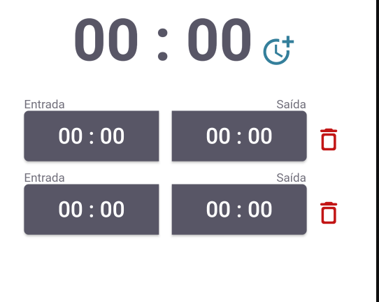

<h1 align="center"> Worney </h1>

 It will help to calculate the hours worked.

 
    <a href="#-project">About</a>&nbsp;&nbsp;&nbsp;│&nbsp;&nbsp;&nbsp;
    <a href="#-dependencies">Dependencies</a>&nbsp;&nbsp;&nbsp;│&nbsp;&nbsp;&nbsp;
    <a href="#-running">Running</a>&nbsp;&nbsp;&nbsp;│&nbsp;&nbsp;&nbsp;
    <a href="#-features">Features</a>&nbsp;&nbsp;&nbsp;│&nbsp;&nbsp;&nbsp;
    <a href="#-license">License</a>

 
    

 

 
    

### 💻 Project

A simple and intuitive time tracking app that helps you calculate your worked hours. Easily add and remove time entries, select start and end times, and view your total worked hours in a clear and concise format. Perfect for freelancers, employees, and anyone who needs to keep track of their work hours.

## Dependencies

To run this script you need to install locally on your machine the following dependencies:

- Android Studio;
- Flutter;

## Running

1. Open the project in Android Studio
2. Open an android emulator or use one cellphone on usb
3. Run the project with `Shift + F10`

## Features

- [x] Calculate hours
- [x] Add hours blocks
- [x] Remove hours blocks
- [ ] In n' Out button
- [ ] Current hour button
- [ ] Pomodoro system
- [ ] B2B tests

### 📜 License

This project is under the MIT license.

---

Projeto feito por KetCode.
